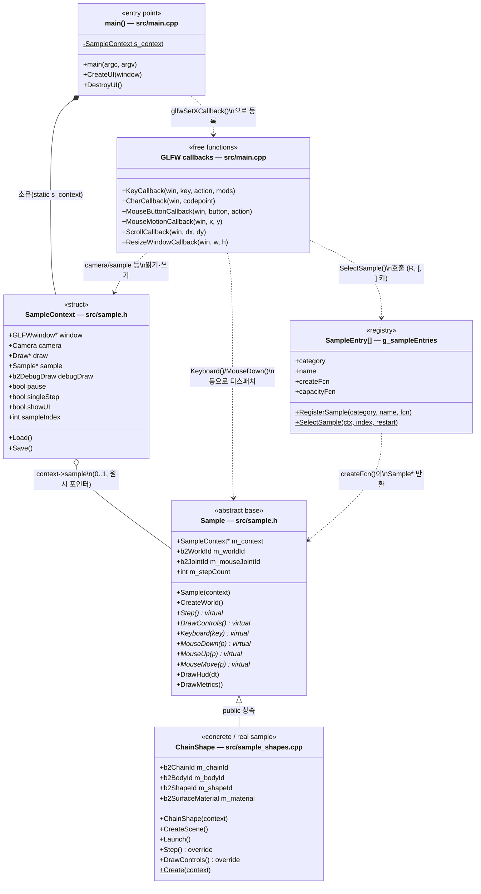

# AGENTS_ARCHITECTURE.md

이 문서는 `AGENTS.md`(분리/빌드 규칙)를 보완하는 문서로, `samples` 실행 파일의 **런타임 제어 흐름**을 Mermaid 다이어그램으로 설명한다.

범위는 다음 흐름 하나로 한정한다.

```text
main() -> GLFW callbacks -> Sample (base class) -> 실제(concrete) 샘플
```

- 진입점/콜백: `src/main.cpp`
- 베이스 클래스 및 레지스트리: `src/sample.h`, `src/sample.cpp`
- 대표 "real sample" 예시: `ChainShape` (`src/sample_shapes.cpp`) — `src/sample_*.cpp` 에 등록된 수십 개 샘플 중 하나를 대표로 사용한다. 다른 샘플도 동일한 패턴(`Sample` 상속, `Create()` 정적 팩토리, `RegisterSample()` 등록)을 따른다.

문서 인코딩은 UTF-8로 유지한다.

## 1. 클래스 다이어그램

정적 구조: 누가 누구를 소유하고, 누가 누구를 호출하며, 실제 샘플이 베이스 클래스에 어떻게 연결되는지를 나타낸다.



관계 설명:

- **`MainCpp *-- SampleContext`(합성)**: `main.cpp` 파일 스코프의 `static SampleContext s_context`가 프로그램 전체 상태(카메라, 창, 현재 샘플 포인터 등)를 보유한다.
- **`MainCpp ..> GlfwCallbacks`(의존)**: `main()`이 `glfwSetKeyCallback()` 등으로 6개의 콜백 함수 포인터를 GLFW에 등록한다.
- **`GlfwCallbacks ..> Sample`(의존)**: 콜백은 ImGui가 입력을 먼저 소비하지 않았을 때만 `s_context.sample`의 가상 함수(`Keyboard`, `MouseDown/Up/Move`)로 위임한다.
- **`SampleContext o-- Sample`(집약)**: `SampleContext::sample`은 현재 활성 샘플을 가리키는 포인터 하나만 가지며, 소유권은 `main()` 루프가 직접 `new`/`delete`로 관리한다(스마트 포인터 아님).
- **`SampleEntry ..> Sample`**: 레지스트리의 `createFcn`(예: `ChainShape::Create`)이 실제 인스턴스를 생성해 `Sample*`로 반환한다.
- **`Sample <|-- ChainShape`(상속)**: 모든 "real sample"은 이 패턴을 따른다. `ChainShape`는 `Step()`/`DrawControls()`만 override하고, `Keyboard()`/`MouseDown()`/`MouseUp()`/`MouseMove()`는 베이스 구현을 그대로 사용한다.

## 2. 시퀀스 다이어그램

한 프레임의 처리 순서를 3단계로 나눈다: 시작, 매 프레임 루프, 그리고 `glfwPollEvents()` 내부에서 동기적으로 발생하는 입력 디스패치.

```mermaid
sequenceDiagram
    autonumber
    participant M as main()
    participant G as GLFW callbacks
    participant S as Sample (base)
    participant C as ChainShape (real sample)

    rect rgb(235,242,250)
    Note over M,C: 1) 시작 — 콜백 등록 및 첫 샘플 생성
    M->>G: glfwSetKeyCallback() 등 6개 콜백 등록
    M->>M: CreateUI(window); draw = CreateDraw()
    M->>C: g_sampleEntries[i].createFcn(ctx)\n(첫 프레임, sample == nullptr일 때만)
    C->>S: Sample(context) 기반 생성자 실행 → CreateWorld()
    C->>C: CreateScene(); Launch();\n(ChainShape 생성자 나머지 부분)
    end

    rect rgb(235,248,240)
    Note over M,C: 2) 매 프레임 — Step / Draw / UI
    M->>M: ImGui::NewFrame()
    M->>C: sample->ResetText(); sample->DrawHud(dt)\n(UI 패널이 꺼져 있을 때)
    M->>C: sample->Step()  (가상 호출)
    C->>S: Sample::Step()\nb2World_Step(); b2World_Draw()
    C->>C: DrawLine() x2\n(ChainShape만의 오버레이 렌더링)
    M->>C: DrawUI() -> sample->DrawControls()\n(Friction/Restitution 슬라이더, Launch 버튼)
    M->>M: ImGui::Render(); glfwSwapBuffers(window)
    M->>G: glfwPollEvents()
    end

    rect rgb(250,242,235)
    Note over M,C: 3) 입력 디스패치 — glfwPollEvents() 내부에서 동기 실행
    G->>G: ImGui_ImplGlfw_KeyCallback();\nWantCaptureKeyboard면 조기 반환
    G->>C: default: sample->Keyboard(key)
    Note right of C: ChainShape는 Keyboard() override가 없어\nSample의 빈 기본 구현으로 폴백된다
    G->>S: case 'R': SelectSample(ctx, i, true)
    Note right of S: delete sample;\nsample = createFcn(ctx) → 1)단계로 복귀
    G->>C: MouseButtonCallback/MouseMotionCallback\n-> MouseDown(p)/MouseUp(p)/MouseMove(p)
    Note right of C: 마우스 조작은 베이스 Sample이 전담\n(마우스 조인트로 바디를 끌어당김)
    end
```

단계 설명:

1. **시작**: `main()`은 루프를 돌기 전에 GLFW 콜백을 등록하고 ImGui/Draw 컨텍스트를 만든다. 첫 번째 샘플은 루프 안에서 `sample == nullptr`일 때 지연 생성된다(ImGui가 `NewFrame()`을 호출하기 전에는 폰트가 없기 때문).
2. **매 프레임**: `main()`의 루프 본문이 `sample->Step()`을 가상 호출하면, 오버라이드한 샘플이라도 보통 `Sample::Step()`(월드 시뮬레이션 진행)을 먼저 호출한 뒤 자신만의 디버그 드로잉을 덧붙인다. UI 패널이 열려 있으면 `DrawUI()`가 `sample->DrawControls()`를 호출해 샘플별 ImGui 위젯을 그린다.
3. **입력 디스패치**: `glfwPollEvents()`는 대기 중인 OS 입력 이벤트에 대해 등록된 콜백을 그 자리에서 동기 호출한다. ImGui가 입력을 캡처하지 않은 경우에만 `Sample`의 가상 함수로 전달되며, 재시작(`R`)/이전·다음 샘플(`[`, `]`) 키는 `SelectSample()`을 통해 현재 샘플을 파괴하고 레지스트리의 `createFcn`으로 새 샘플을 다시 생성한다(1단계로 순환).

## 3. 다이어그램 요소 ↔ 실제 파일 매핑

| 다이어그램 요소 | 실제 위치 |
| --- | --- |
| `main()`, `CreateUI`/`DestroyUI` | `src/main.cpp` |
| GLFW 콜백 6종 (`KeyCallback` 등) | `src/main.cpp` |
| `SampleContext` | `src/sample.h` (정의), `src/sample.cpp` (`Load`/`Save`) |
| `Sample` 베이스 클래스 | `src/sample.h` (선언), `src/sample.cpp` (구현) |
| `SampleEntry`, `g_sampleEntries[]`, `RegisterSample`, `SelectSample` | `src/sample.h`, `src/sample.cpp` |
| `ChainShape` (대표 real sample) | `src/sample_shapes.cpp` |
| 그 외 real sample들 | `src/sample_bodies.cpp`, `src/sample_joints.cpp`, `src/sample_events.cpp` 등 `src/sample_*.cpp` 전체가 동일 패턴을 반복 |
