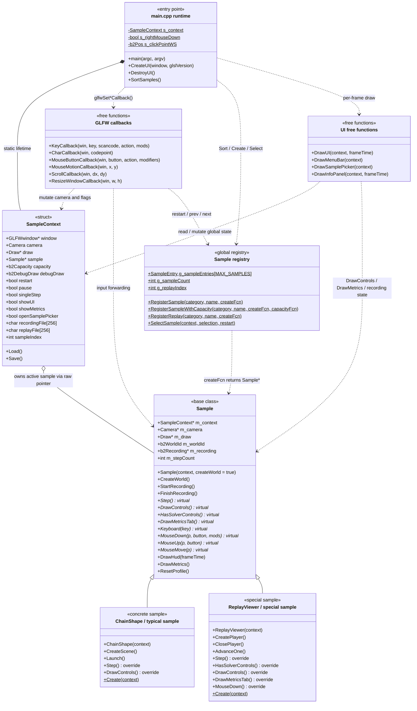

# AGENTS_ARCHITECTURE.md

이 문서는 `AGENTS.md`(분리/빌드 규칙)를 보완하는 문서로, `samples` 실행 파일의 런타임 구조와 객체 수명주기를 Mermaid 다이어그램으로 설명한다.

범위는 다음 흐름으로 정의한다.

```text
main loop -> global SampleContext -> sample registry -> active Sample -> UI / callbacks
```

- 진입점: `src/main.cpp`
- 베이스 클래스 및 레지스트리: `src/sample.h`, `src/sample.cpp`
- 일반 샘플 예시: `ChainShape` (`src/sample_shapes.cpp`)
- 특수 샘플 예시: `ReplayViewer` (`src/sample_replay.cpp`)

문서 인코딩은 UTF-8로 유지한다.

## 1. 핵심 구조 요약

이 실행 파일은 전형적인 "얇은 앱 셸 + 전역 컨텍스트 + 동적 샘플 교체" 구조다.

- `main.cpp` 는 앱 셸이다.
  - GLFW 초기화
  - ImGui / ImPlot 초기화
  - Draw 객체 생성
  - 프레임 루프 실행
  - 콜백 등록
- `SampleContext` 는 앱 전역 상태 묶음이다.
  - 현재 활성 샘플 포인터
  - 카메라 / 디버그 드로우 / UI 토글 / 재생 파일 경로 / 저장 설정
- `g_sampleEntries[]` 는 전역 레지스트리다.
  - 각 샘플은 정적 초기화 시점에 `RegisterSample()` 또는 `RegisterReplay()` 로 등록된다.
- `Sample` 은 단순 인터페이스가 아니다.
  - Box2D world 수명주기
  - 기본 입력 처리
  - recording
  - metrics / HUD
  - 프로파일 수집
  를 함께 보유하는 두꺼운 베이스 클래스다.
- `SelectSample()` 는 현재 샘플을 즉시 파괴하고 새 샘플을 생성한다.
  - 이 호출은 키보드 콜백, 메뉴 UI, 샘플 picker, Replay open 경로에서 모두 발생할 수 있다.

즉, 클래스 다이어그램을 볼 때 가장 먼저 봐야 할 포인트는 "상속"이 아니라 "누가 현재 샘플을 소유하고 언제 교체하는가"이다.

## 2. 클래스 다이어그램

정적 구조는 아래와 같다.



## 3. 관계 설명

- `MainRuntime *-- SampleContext`
  - `main.cpp` 파일 스코프의 `static SampleContext s_context` 가 프로그램 전체 상태를 가진다.
  - 이 상태는 DI 컨테이너가 아니라, 사실상 앱 전역 mutable singleton 역할이다.

- `SampleContext o-- Sample`
  - 활성 샘플은 `SampleContext::sample` 포인터 하나로 관리된다.
  - 소유권은 스마트 포인터가 아니라 `SelectSample()` 과 종료 루틴의 `delete` 에 의해 수동 관리된다.

- `SampleRegistry ..> Sample`
  - 레지스트리는 `createFcn` 함수 포인터를 저장하고 있다가, 선택 시점에 concrete sample 인스턴스를 동적으로 생성한다.
  - `Replay` 는 일반 샘플과 같은 배열에 들어가지만 `g_replayIndex` 라는 별도 전역 인덱스로도 추적된다.

- `UiFunctions ..> SampleRegistry`
  - UI는 단순 표시가 아니다.
  - 메뉴 클릭이나 sample picker 선택으로 `SelectSample()` 를 호출해 현재 샘플을 교체할 수 있다.

- `Sample <|-- ReplayViewer`
  - `ReplayViewer` 는 "일반 샘플 하나"가 아니라 베이스 계약을 부분적으로 우회하는 특수 샘플이다.
  - `Sample(context, false)` 로 base world 생성을 건너뛰고, 자체 replay player 가 공급하는 world 를 사용한다.
  - 따라서 `Sample::Step()` 의 기본 시뮬레이션 흐름을 따르지 않는다.

## 4. 시퀀스 다이어그램

아래 다이어그램은 "일반 프레임 진행"과 "샘플 교체"를 같이 보여준다.

```mermaid
sequenceDiagram
    autonumber
    participant M as main loop
    participant U as UI free functions
    participant R as sample registry
    participant S as active Sample
    participant G as GLFW callbacks

    rect rgb(235,242,250)
    Note over M,R: 1) startup
    M->>M: s_context.Load()
    M->>R: SortSamples()
    M->>M: CreateUI(window), CreateDraw()
    end

    rect rgb(235,248,240)
    Note over M,S: 2) per-frame loop
    M->>M: ImGui_ImplOpenGL3_NewFrame()
    M->>M: ImGui_ImplGlfw_NewFrame()
    M->>M: ImGui::NewFrame()
    alt sample == nullptr
        M->>R: createFcn(&s_context)
        R-->>M: new Sample*
        M->>S: constructor / optional CreateWorld()
    end
    M->>S: ResetText()
    opt showUI == false
        M->>S: DrawHud(frameTime)
    end
    M->>S: Step()
    M->>U: DrawUI(&s_context, frameTime)
    Note right of U: DrawUI may call SelectSample(),\nwhich deletes and replaces S
    M->>M: ImGui::Render()
    M->>M: glfwSwapBuffers()
    M->>G: glfwPollEvents()
    end

    rect rgb(250,242,235)
    Note over G,R: 3) callback-driven switching
    G->>G: ImGui_ImplGlfw_*Callback()
    alt ImGui captures input
        G-->>G: return
    else sample input
        G->>S: Keyboard / MouseDown / MouseUp / MouseMove
    end
    alt R / [ / ] or Replay open
        G->>R: SelectSample(&s_context, selection, restart)
        R->>S: delete old sample
        R->>R: resolve capacity
        R->>R: createFcn(context)
        R-->>G: new Sample*
    end
```

## 5. 일반 샘플과 특수 샘플의 차이

### 5.1 일반 샘플

대부분의 샘플은 아래 패턴을 따른다.

1. 생성자에서 `Sample(context)` 호출
2. 베이스 생성자가 `CreateWorld()` 실행
3. concrete sample 생성자에서 scene 구성
4. `Step()` override 에서 `Sample::Step()` 호출 후 overlay / debug draw 추가

대표 예시는 `ChainShape`, `RollingResistance`, `FarGate` 등이다.

이 패턴의 장점:

- 공통 world stepping 로직 재사용
- 공통 mouse joint, HUD, metrics, recording 재사용

이 패턴의 제약:

- 베이스 클래스의 world / input / UI 계약에 강하게 묶인다
- 샘플별로 `Keyboard()` 또는 `MouseDown()` 을 override 하기 시작하면 입력 정책이 분산된다

### 5.2 ReplayViewer

`ReplayViewer` 는 일반 샘플과 다르다.

1. `Sample(context, false)` 로 base world 생성을 생략
2. replay file 로부터 `b2RecPlayer` 생성
3. 매 프레임 `b2RecPlayer_StepFrame()` 또는 seek 로 world 상태를 갱신
4. solver control 은 숨기고, metrics drawer 에 timeline / inspector 기능을 추가

즉 `ReplayViewer` 는 상속 계층에는 포함되지만, 실제 역할은 "샘플"이라기보다 "recording viewer tool" 에 가깝다.

## 6. 실제 구현과 맞춘 주의점

아래 항목은 클래스 다이어그램을 읽을 때 반드시 함께 봐야 하는 제약이다.

- 현재 샘플은 프레임 도중 교체될 수 있다.
  - 키 입력
  - 메뉴 클릭
  - sample picker
  - Replay open
  경로 모두 `SelectSample()` 로 수렴한다.

- 따라서 `Sample*` 를 장시간 캐시하는 코드는 위험하다.
  - `DrawUI()` 가 sample 을 바꿀 수 있으므로, UI 호출 전후에 같은 포인터가 살아 있다고 가정하면 안 된다.

- `SampleContext` 는 순수한 context 객체가 아니다.
  - persistent settings
  - transient UI state
  - active sample
  - runtime toggles
  가 모두 혼합되어 있다.

- `Sample` 은 얇은 추상 인터페이스가 아니다.
  - world lifecycle
  - interaction
  - recording
  - diagnostics
  를 함께 가진다.
  - 따라서 base class 변경은 concrete sample 다수에 파급된다.

- registry 는 global static initialization 에 의존한다.
  - 각 `sample_*.cpp` 의 정적 변수 초기화 순서에 의해 등록이 일어난다.
  - 이후 `SortSamples()` 로 배열 순서가 다시 바뀐다.
  - `Replay` 위치는 `g_replayIndex` 와 함수 포인터 비교로 재탐색한다.

## 7. 다이어그램 요소와 실제 파일 매핑

| 다이어그램 요소 | 실제 위치 |
| --- | --- |
| `main loop`, `CreateUI`, `DestroyUI`, GLFW callback 등록 | `src/main.cpp` |
| `SampleContext` | `src/sample.h`, `src/sample.cpp` |
| `Sample`, `SampleEntry`, registry 함수 | `src/sample.h`, `src/sample.cpp` |
| UI free functions (`DrawUI`, `DrawMenuBar`, `DrawSamplePicker`, `DrawInfoPanel`) | `src/sample.cpp` |
| 일반 concrete sample 예시 `ChainShape` | `src/sample_shapes.cpp` |
| 특수 sample `ReplayViewer` | `src/sample_replay.cpp` |

## 8. 결론

이 프로젝트의 런타임 아키텍처를 한 줄로 요약하면 다음과 같다.

```text
main loop 가 global context 와 global registry 를 중심으로 현재 Sample 을 생성/삭제하며,
UI 와 callbacks 가 그 수명주기를 직접 흔드는 구조
```

따라서 이 구조를 검토하거나 리팩터링할 때의 우선순위는 다음 순서가 맞다.

1. 상속 계층보다 객체 수명주기부터 본다.
2. `SelectSample()` 로 수렴하는 교체 경로를 먼저 본다.
3. `ReplayViewer` 를 일반 샘플과 분리해서 본다.
4. `SampleContext` 와 `Sample` 의 과도한 책임 집중을 인지한 상태에서 변경 범위를 잡는다.
